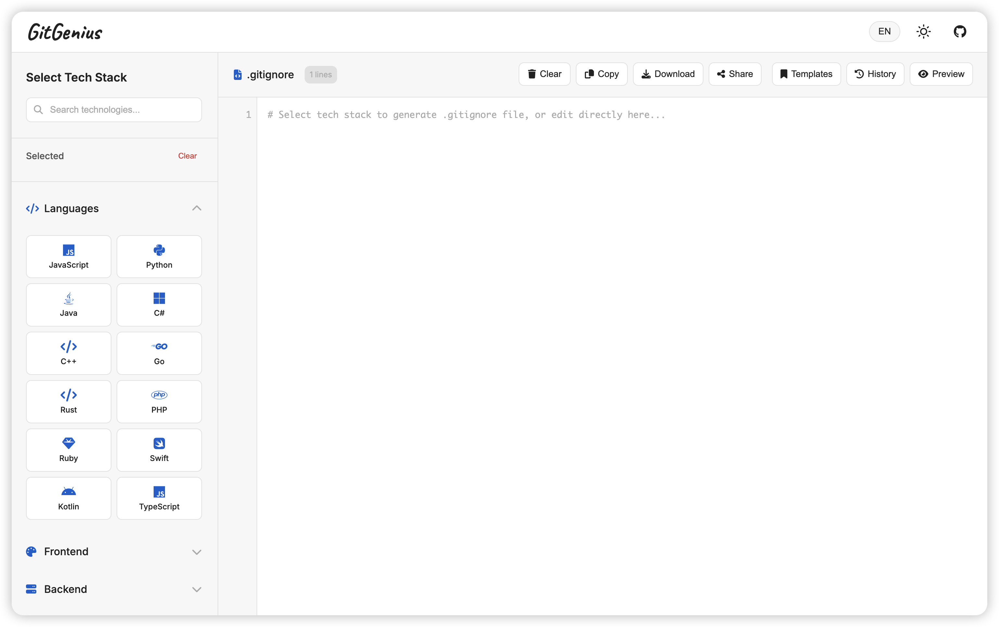

# GitGenius

**A Modern .gitignore File Generator**

[English](./README.md) | [简体中文](./README.zh-CN.md)

## Screenshot

## Features

- **Simple Interface** - Clean and intuitive user interface
- **Rich Templates** - Comprehensive collection of .gitignore templates
- **Custom Options** - Customize templates to your needs
- **One-Click Copy** - Easy copy to clipboard functionality
- **Open Source** - Free and open source

## 📄 License

This project is licensed under the [MIT License](LICENSE).

## 🤝 Contributing

Contributions are welcome! Feel free to open issues and submit pull requests.

---

Made with ❤️ by [penjc](https://pengjiancheng.com)

 