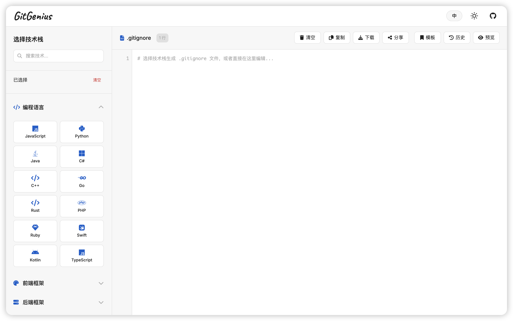

# GitGenius

**现代化的 .gitignore 文件生成器**

[English](./README.md) | [简体中文](./README.zh-CN.md)

## 截图

## 特性

- **简洁界面** - 清晰直观的用户界面
- **丰富模板** - 全面的 .gitignore 模板集合
- **自定义选项** - 根据需求自定义模板
- **一键复制** - 便捷的剪贴板复制功能
- **开源免费** - 自由开源的项目

## 📄 许可证

本项目基于 [MIT 许可证开源](LICENSE)。

## 🤝 贡献

欢迎贡献！随时欢迎提出问题和提交拉取请求。

---

由 [penjc](https://pengjiancheng.com) 用 ❤️ 制作

 